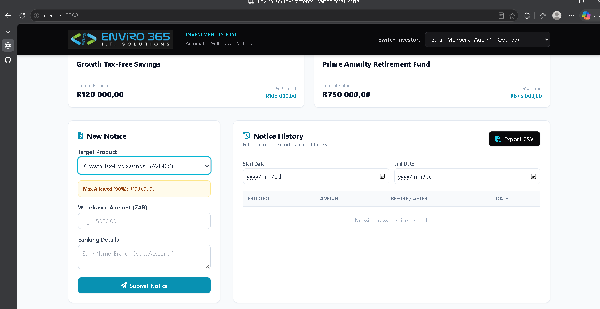
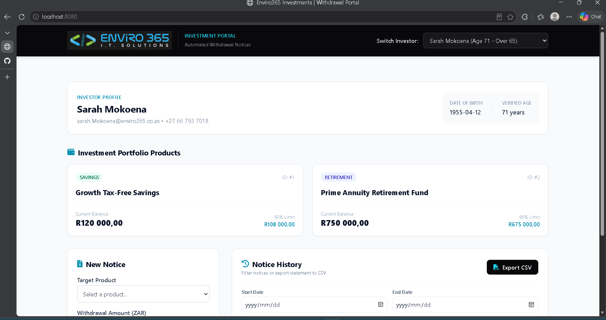
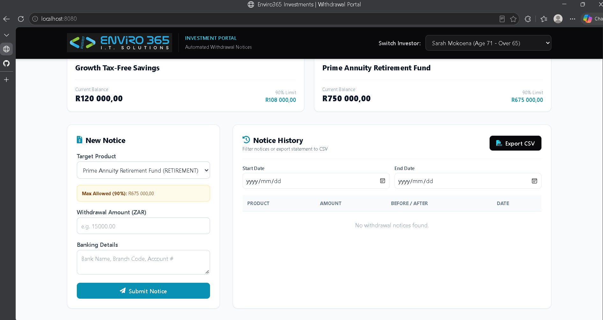
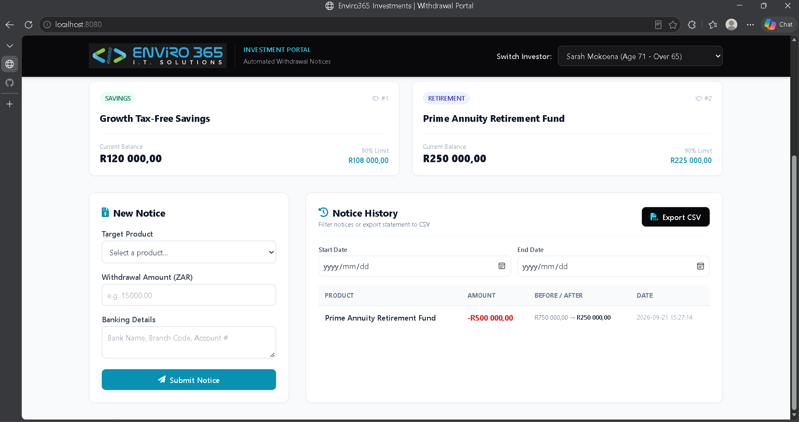
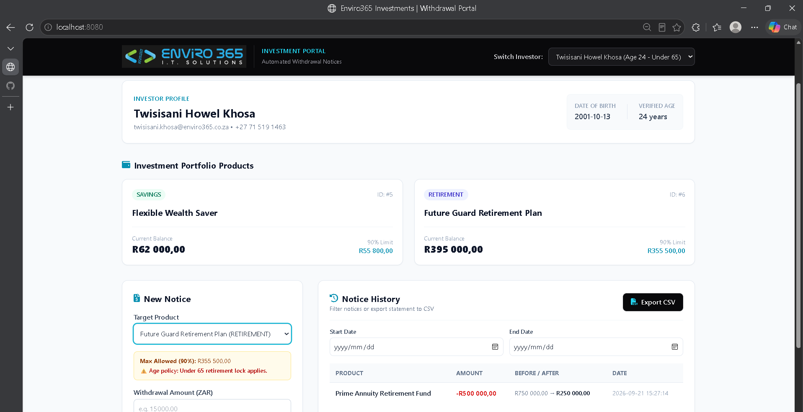
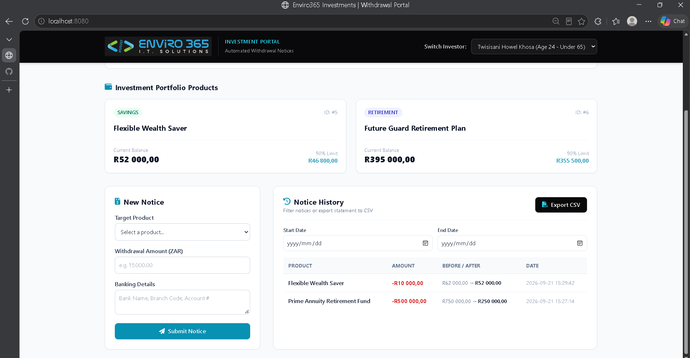
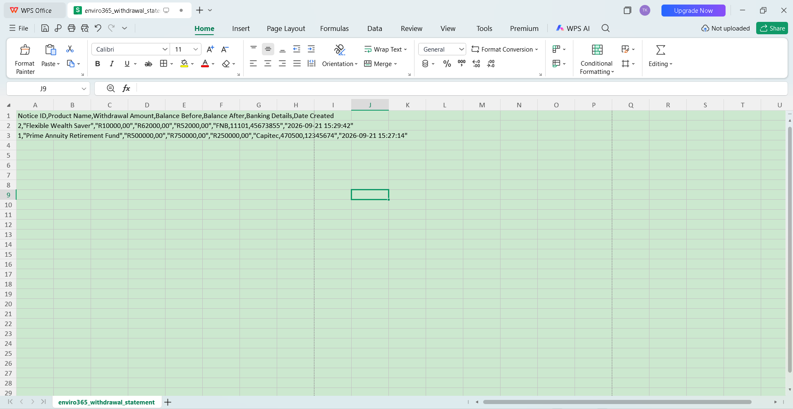

# Enviro365 Investments - Automated Withdrawal Notice System

Full-stack Spring Boot and responsive web interface built for the eTalente Junior Developer Technical Assessment. The system automates investor withdrawal notices, enforces regulatory and product balance rules, records balance histories before and after transactions, and exports CSV statements.

---

## Business Rules Enforced

* **Retirement Age Verification:** Withdrawals from `RETIREMENT` products are strictly restricted to investors older than 65 years of age (`age > 65`).
* **Current Balance Constraint:** A withdrawal amount cannot exceed the product's current balance.
* **90% Maximum Limit:** An investor cannot withdraw more than 90% of the product's current balance in a single notice.
* **Transactional Balance Integrity:** Product balances update atomically upon withdrawal submission, preserving an audit trail of `balanceBefore` and `balanceAfter`.

---

## Technical Architecture & Rubric Coverage

* **Package Structure:** `com.enviro.assessment.junior.twisisanikhosa`
* **Backend:** Java 17, Spring Boot 3.2.5, Spring Data JPA, Jakarta Bean Validation.
* **Database:** In-memory H2 database (`jdbc:h2:mem:enviro365db`) initialized with seed data.
* **Frontend:** Responsive Single-Page Application (HTML5, Tailwind CSS, JavaScript) served from `src/main/resources/static/index.html`.
* **Advanced Features Implemented (All 5 of 5):**
  * **Global Exception Handling:** `@RestControllerAdvice` converting domain and validation errors into structured JSON error models (`ApiErrorResponse`).
  * **DTO Layer:** Immutable Java `record` implementations (`PortfolioResponseDto`, `WithdrawalRequestDto`, `WithdrawalResponseDto`, `ProductDto`).
  * **Input Validation:** Jakarta constraints (`@NotNull`, `@DecimalMin`, `@NotBlank`) enforced at the controller boundary.
  * **Unit Tests:** JUnit 5 and Mockito suite covering boundary conditions, age restrictions, and limit calculations.
  * **UI Validation:** Real-time client-side checks and warnings prior to form submission.

---

## Getting Started

### Prerequisites
Java Development Kit (JDK):** 17 or higher
Apache Maven: 3.8+ (or bundled wrapper)
Web Browser: Any modern browser

Installation & Execution

1. Clone the repository:
   ```bash
   git clone [https://github.com/Twisisani/enviro365-withdrawal-system.git](https://github.com/Twisisani/enviro365-withdrawal-system.git)
   cd enviro365-withdrawal-system
Execute automated unit tests:

Bash
mvn clean test
Start the application:

Bash
mvn spring-boot:run
Access the Application:

Web Portal: Open http://localhost:8080

H2 Database Console: Open http://localhost:8080/h2-console

JDBC URL: jdbc:h2:mem:enviro365db

User Name:sa

Password: (leave blank)

Savings Product Selection & Live 90% Limit Calculation


Investor Profile Dashboard & Product Portfolio Overview


Retirement Product Selection for Eligible Investor (Age > 65)


Processed Retirement Notice & Atomic Balance Audit Trail


Enforcement of Under-65 Retirement Policy Lock


Savings Notice Execution & Multi-Notice History Log


Exported CSV Statement Opened in Spreadsheet Viewer

